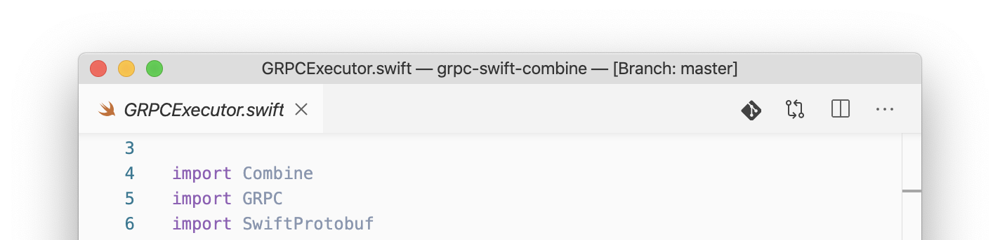
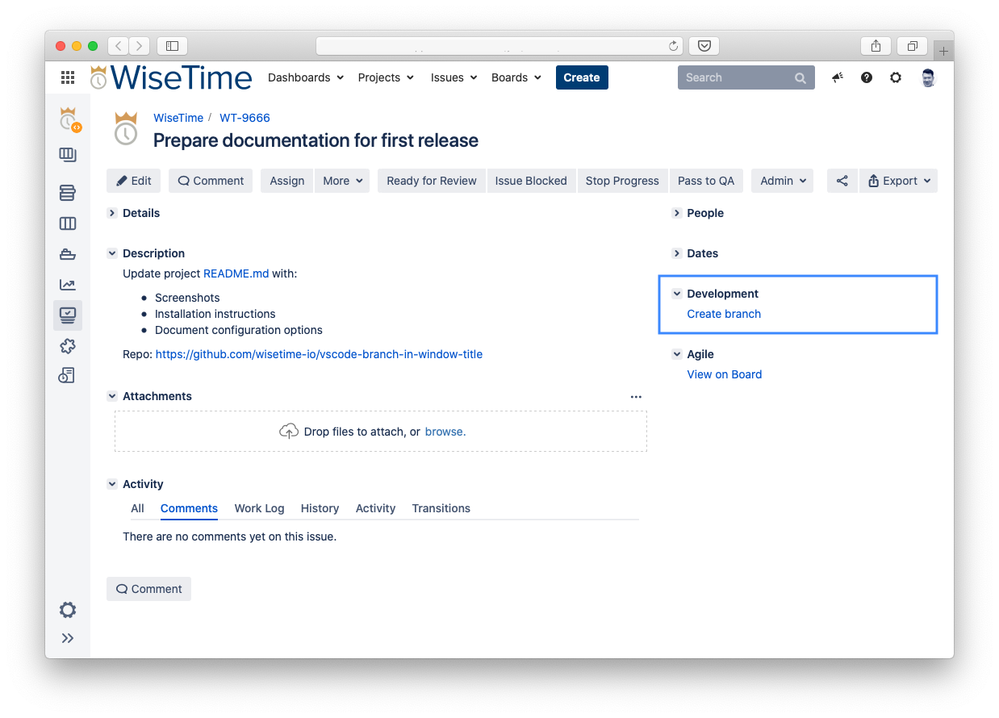
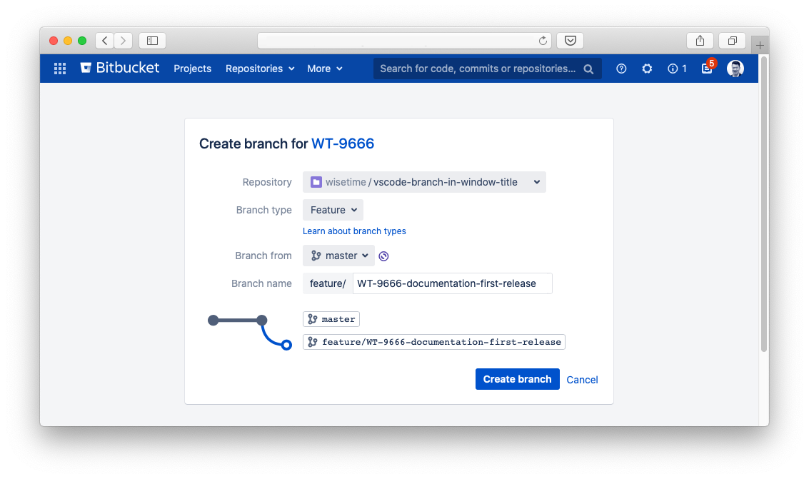
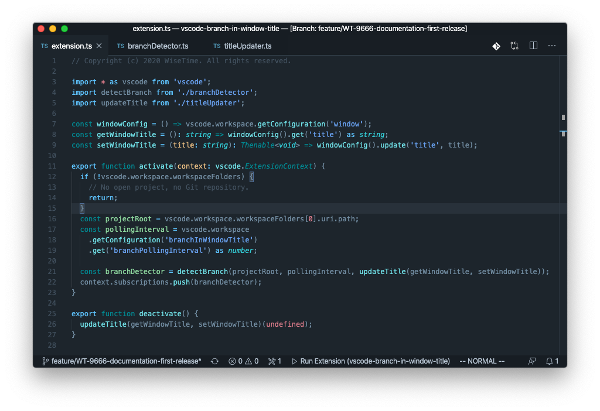
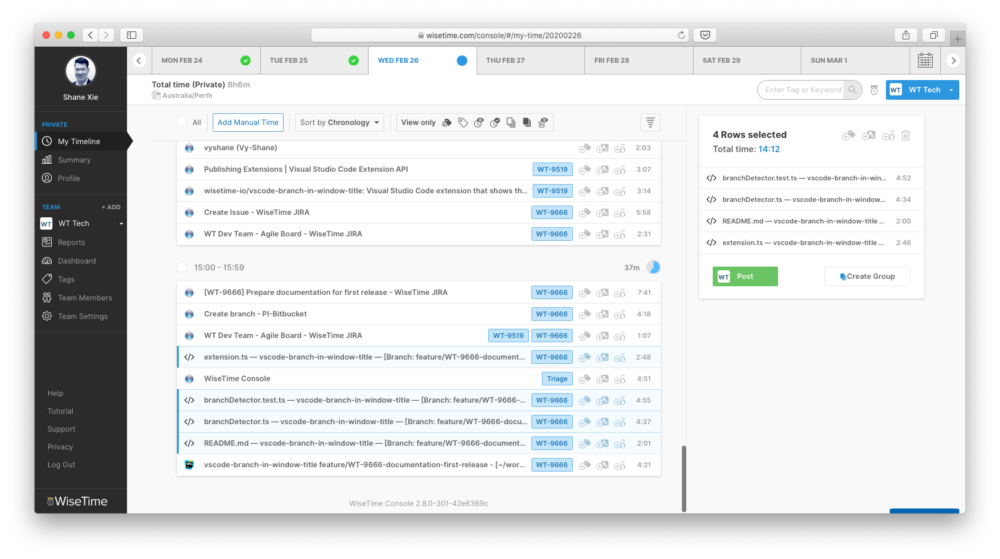
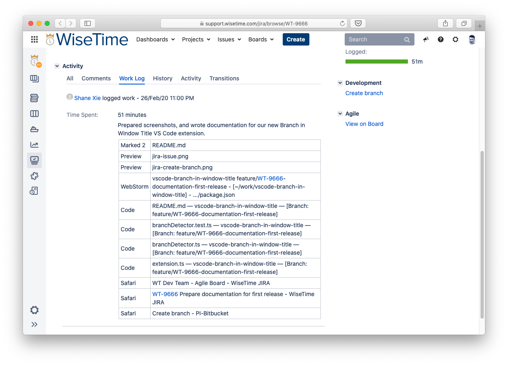

# Branch in Window Title VS Code Extension

**Branch in Window Title** is a simple [Visual Studio Code](https://code.visualstudio.com) extension that looks for a Git repository in the currently open workspace. If a Git repository is detected, the current branch name is appended to the VS Code window title.



## Installation

If you already have VS Code installed on your machine, you can click this link to install the extension:

* [Install Branch in Window Title Extension](vscode:extension/wisetime.branch-in-window-title)

Alternatively, you can [download the latest release](https://github.com/wisetime-io/vscode-branch-in-window-title/releases/download/v0.1.0/branch-in-window-title-0.1.0.vsix) of Branch in Window Title, then install the extension via the command line:

```text
code --install-extension branch-in-window-title-0.1.0.vsix
```

You can also install the extension by using the `Install from VSIX` command in the Extensions view command drop-down, or the `Extensions: Install from VSIX` command in the Command Palette.

## Automated Timekeeping for Development Teams

Branch in Window Title can be used to automate time allocation to issue tracking systems via [WiseTime](https://wisetime.com). Our engineering team uses Jira, and this is how it fits into our development workflow at WiseTime.

<p align="center">
  
</p>

### Keep Calm and Flow on

I've got my brew next to me, my headphones on. Let's get some some work done. I check my Jira board and start on a new ticket. I read the issue description, looks easy enough for a change! First up I need to create a new branch. There's a Create Branch link right there in Jira. Let's click it.



I select the relevant repository, and choose to branch from master.



By default, Bitbucket will add the Jira issue number to the branch name. If I can get this branch name into my window title, WiseTime will be able to automatically tag the time I spend in Visual Studio Code with the right issue. This is exactly what the Branch in Window Title extension allows me to do.

I checkout the branch and open the project in VS Code.



While I work in VS Code, my activity starts showing up in my [private](https://wisetime.com/privacy-by-design/) timeline in the WiseTime console, tagged with the Jira issue number.



This means that I can go about my day without ever worrying about time keeping. WiseTime keeps an accurate record of what I have been doing, even if I've been multitasking like crazy (I don't recommend). At the end of the day, or week (I don't recommend!), I can review my timeline and post time to the team.

Our [WiseTime Jira Connector](https://wisetime.com/jira/) ([also open source](https://github.com/wisetime-io/wisetime-jira-connector)!) then receives the posted time and creates a worklog entry against the Jira issue.



The Jira Connector also watches Jira for new issues and automatically syncs them to WiseTime as tags for automatic activity tagging. The Jira Connector is a small application that integrates with both WiseTime and Jira APIs. If you are using Jira Cloud, we allow you to provision a Jira Cloud Connector through your WiseTime team settings page. If you are running your own Jira Server, you can pull our Jira Connector Docker image and connect it to your onprem instance.

### Many Connection Options

Not using Jira? We offer many other types of [Connectors](https://wisetime.com/connectors/), including [Zapier](https://wisetime.com/zapier/). We also provide the [WiseTime Connect API](https://wisetime.com/docs/connect/), as well as a [WiseTime Connector Java Library](https://github.com/wisetime-io/wisetime-connector-java) that wraps the API. With these, you can easily implement your own custom connector.

## Extension Settings

In order to detect the current Git branch, the Branch Title in Window extension polls the filesystem at regular intervals. By default it checks every 3000 milliseconds. You can change the polling interval by updating the `branchInWindowTitle.branchPollingInterval` setting. It expects an integer value in milliseconds.

## Using an IntelliJ-based IDE?

We also have you covered if you use a JetBrains IDE. You can grab our Branch in Window Title plugin for IntelliJ, Websorm & friends [here](https://plugins.jetbrains.com/plugin/9675-branch-in-window-title).
